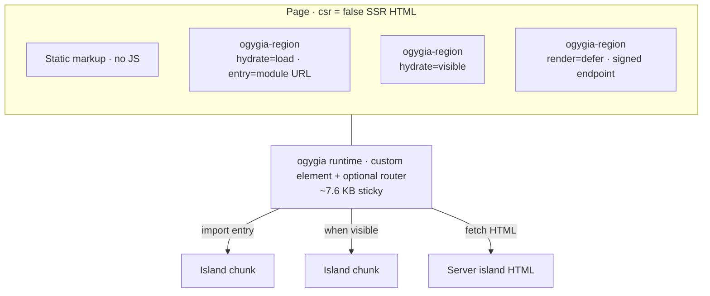
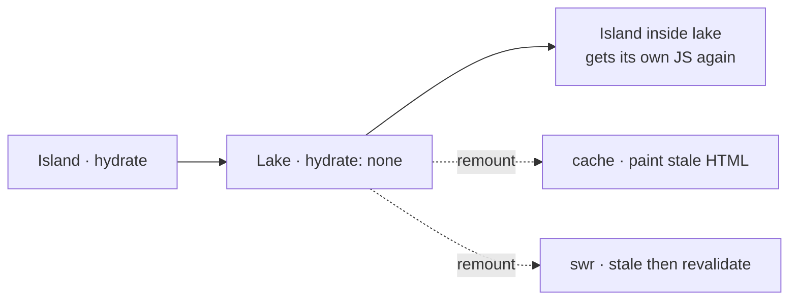
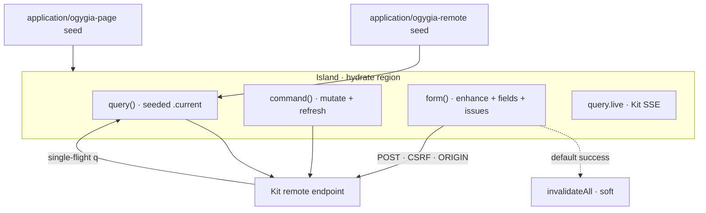

# ogygia

<div class="subtitle">

SSR islands for SvelteKit — no Kit patches.

</div>

<div class="meta mt-8">

npm · ogygia &nbsp;·&nbsp; docs · ogygia.puruvj.dev &nbsp;·&nbsp; 0.4.x

</div>

<div class="footer-note">

csr = false &nbsp;·&nbsp; ~7.6 KB runtime &nbsp;·&nbsp; real Kit remotes

</div>

<!--
Okay — quick name check. ogygia. It's Calypso's island in the Odyssey. You wash up, you stay awhile. That's the joke and also kind of the point: this is the islands layer for SvelteKit.

I'm not pitching a new framework. Kit stays Kit. What ogygia does is: keep the page as server HTML, and let you opt individual components into JavaScript — Astro-style islands, without patching Kit.

You'll see the docs URL and the version. We're on 0.4.x. If you're short on time later, the only chapter you can't skip is Remote Functions — that's the "this is real product" part.

Optional aside if the room knows mythology: yeah, Odysseus got stuck there for seven years. Hopefully your JS budget is smaller than that.
-->

---
layout: center
class: text-left
---

<div class="eyebrow">The gap</div>

# Kit is all-or-nothing on the client

<div class="compare mt-6">
<div class="card">

### `csr = true` (default)

Whole route boots Kit's client. Great for apps. You pay for interactivity you may not need on marketing, docs, content.

</div>
<div class="vs">vs</div>
<div class="card">

### `csr = false`

No Kit client. Forms still work. But you get **zero** component interactivity — no islands story built in.

</div>
</div>

<p class="lede mt-8">

Astro proved the islands model. SvelteKit never shipped one — until you add it without forking Kit.

</p>

<!--
So here's the problem I'm solving. Look at the two cards.

Left side: csr true — Kit's default. The whole route boots the client. That's correct for a dashboard. It's a weird tax for a docs site where three widgets need clicks and the rest is prose.

Right side: csr false. Kit will happily give you that. Forms still post. But there's no built-in "and this one Counter hydrates." You're just… static. Or you invent your own thing.

Astro made islands boring and good. Kit never shipped that story. People either live with full hydration, or they leave Kit for content pages. ogygia is: stay on Kit, get the islands model, don't fork the framework.

Emphasize: I'm not saying Kit is wrong. I'm saying the gap is real for content-heavy and selectively interactive pages.

If short on time: skip the Astro name-drop, jump straight to "csr false has no islands API."
-->

---
layout: center
---

<div class="eyebrow">One-liner</div>

# Keep the page as server HTML.<br>Opt components into JS.

<div class="pill-row mt-8">
<span class="pill accent">Vite plugin</span>
<span class="pill accent">WC runtime</span>
<span class="pill accent">server handle</span>
<span class="pill">no Kit patches</span>
<span class="pill">deep-imports remotes</span>
</div>

<p class="dim mt-8" style="max-width: 34em">

Mark an import with `hydrate` / `defer` / `preset`. Everything else stays SSR HTML. Optional SPA router when you want soft navigations.

</p>

<!--
If you remember one sentence from this talk, make it the headline: keep the page as server HTML, opt components into JS.

How it's built — the accent pills. Vite plugin first. Tiny custom-element runtime. A server handle for signed holes. That's the whole surface. We do not patch Kit. When remotes show up later, that's Kit's own code deep-imported, not a fake RPC layer I invented.

Authoring is an import attribute: hydrate, defer, or a named preset. Everything unmarked stays SSR HTML. SPA router is optional — MPA is a valid way to run this.

Numbers if someone asks: runtime's about 7.6 KB min+brotli with the router. Peers are current Svelte 5 / Kit 2 / Vite 5 through 8.

Skip the peer versions unless someone asks. Don't linger on the pills — the sentence is the slide.
-->

---

<div class="eyebrow">Mental model</div>

# Page host vs island regions



<p class="faint mt-4">

Each hydrate island puts its **module URL** on `<ogygia-region entry>` — Astro-style. The sticky runtime does not grow with island count.

</p>

<!--
Walk the diagram with me — start at the top box. That's the page. csr false. Mostly static markup. No Kit client bootstrap.

Inside it you'll see ogygia-region custom elements. Three flavors on the slide: hydrate on load with an entry module URL, hydrate when visible, and defer — that's a signed endpoint, HTML arrives later.

Below that: the sticky runtime. One custom element plus an optional router. Small. It doesn't embed a map of every island in your app. Point at the arrows — for hydrate it does import(entry). For visible it waits, then imports. For defer it fetches HTML and swaps.

The thing that matters for scale: each hydrate region carries its own module URL on the entry attribute. Astro does this. So adding the thousandth counter doesn't grow the runtime bundle. The runtime stays dumb and sticky; the islands own their JS.

Vocabulary I'll use the rest of the talk — four words: page, island, lake, server island. Nesting rule in one breath: island inside island shares the parent's JS. We'll hit lakes in a minute.

If short on time: don't explain all three region types — just "page is HTML, regions wake up via a tiny runtime, entry URL per island."
-->

---

<div class="eyebrow">Authoring</div>

# Import attributes are the API

```svelte
<script>
  import Counter from '$lib/Counter.svelte' with { hydrate: 'load' };
  import Chart from '$lib/Chart.svelte' with { hydrate: 'visible' };
  import Greeting from '$lib/Greeting.svelte' with { defer: 'load' };
</script>

<Counter start={10} />
<Chart />
<Greeting name="world">
  {#snippet ogygiaFallback()}<p>loading…</p>{/snippet}
</Greeting>
```

<div class="grid-3 mt-4">
<div class="card">

### Setup

`ogygia()` **before** `sveltekit()` in Vite. `ogygiaHandle()` in hooks. `csr = false` on the route.

</div>
<div class="card">

### Binding is the island

`A` is a portable wrapper — not a tag-site rewrite. Lists / `svelte:component` work (0.4).

</div>
<div class="card">

### Static import only

Dynamic `import(…, { with })` **fails the build**. Lazy mount = plain `await import` inside a host island.

</div>
</div>

<!--
This is what you actually type. Look at the script — three imports, three with-clauses. load, visible, defer. Then you use them like normal components. The Greeting one has ogygiaFallback — that's the placeholder snippet while the server HTML is in flight.

Three cards under it, left to right.

Setup: plugin before sveltekit — order matters. Handle in hooks. csr false on the routes you convert. You can adopt one route at a time.

Middle card — this is the 0.4 punchline, next slide goes deeper: the binding itself is the island. Counter isn't a magical tag rewrite. It's a portable component. You can put it in a list. You can svelte:component it.

Right card — gotcha. Dynamic import with those attributes? We fail the build on purpose. Vite strips them, it'd silently no-op, that's worse. Want click-to-load JS? Host island, plain await import, regular component. Not a second island.

Emphasize the code block more than the cards. If short: skip the dynamic-import gotcha.
-->

---

<div class="eyebrow">Strategies</div>

# Same timing words · two meanings

<dl class="kv mt-4">
  <dt>load</dt><dd>Right away</dd>
  <dt>idle</dt><dd>When the browser is idle</dd>
  <dt>visible</dt><dd>When scrolled into view</dd>
  <dt>'(mq)'</dt><dd>When a media query matches</dd>
  <dt>none</dt><dd>Lake — static HTML inside an island · no lake JS</dd>
</dl>

<div class="grid-2 mt-6">
<div class="card">

### On `hydrate`

When **JS** starts for that region.

</div>
<div class="card">

### On `defer`

When the placeholder is replaced with **HTML** from the signed endpoint.

</div>
</div>

<p class="dim mt-4">

Combo: `with { defer: '…', hydrate: '…' }` — fetch HTML, then hydrate that DOM. Matching schedules coalesce (no second idle/IO after swap).

</p>

<!--
Timing vocabulary is shared on purpose so you don't learn two APIs.

Read the list once: load, idle, visible, a media query string, and none — none is the lake, we'll do that next.

Here's the trick. Same word, two meanings depending on the attribute. On hydrate, "visible" means when JS starts. On defer, "visible" means when we fetch and swap the HTML. Point at the two cards.

You can combine them: defer plus hydrate. Phase one gets HTML. Phase two hydrates that DOM. If both say idle, we don't make you wait idle twice — they coalesce after the swap. hydrate load after any defer just means ASAP once the HTML is there.

Don't recite every strategy. Pick visible as the example people feel in their gut. Skip the coalesce detail if you're running long — it's in the docs.
-->

---

<div class="eyebrow">0.4 · Portable bindings</div>

# `A` is the wrapper

```js
import A from './A.svelte' with { hydrate: 'load' };

// all of these work
<A start={n} />
<svelte:component this={A} {...props} />
list = [{ comp: A, props }];  // + {#each}
```

<div class="grid-2 mt-6">
<div class="card">

### Rules

- Props are real Svelte props → **devalue** for the region/endpoint
- Put UI + lakes **inside** the island file
- Host children are a **build error** (except `ogygiaFallback` on defer)

</div>
<div class="card">

### Dedupe

Same path + strategy → **one** wrapper + one client entry. 1000× same binding → 1 module, not 1000. Each instance still gets its own region + props at SSR.

</div>
</div>

<!--
0.4 changed the mental model, so I'm going to slow down here.

You import A with hydrate load. A is not "the original component plus a compiler magic at the tag site." A is a portable island wrapper. So all three usages in the snippet are legal — normal tag, svelte:component, stash it in a list and each over it. That's what people actually build.

Rules on the left — say them like boundaries, not footnotes. Props are real props; they get devalue'd for the wire. Your UI and your lakes live inside the island file. Host children across that boundary? Build error. Exception: ogygiaFallback on defer, because something has to show while HTML is loading.

Right card — identity dedupe. Same file, same strategy, one client entry for the whole app. A thousand counters sharing that binding share one module URL. Each instance still gets its own region and its own props at SSR. So you're not paying N bundles for N instances of the same thing.

Aside if someone's on an older blog post: pre-0.4 we hoisted tag-site markup into virtual modules. That's gone. Good riddance.

If short on time: read the three usages, say "portable," skip dedupe numbers.
-->

---

<div class="eyebrow">Lakes · remount</div>

# Freeze a subtree · cache what you can



<div class="grid-2 mt-6">
<div class="card">

### Lake

`with { hydrate: 'none' }` inside an island. SSR keeps the real component; client gets a placeholder. **Zero** lake client JS.

</div>
<div class="card">

### Remount

When a lake CE is re-created: `cache` or `swr` (+ schedule / `maxAge`). SWR hits the signed endpoint — same trust model as defer.

</div>
</div>

<!--
Diagram, left to right. Start at Island — that's interactive, it has JS. Inside it you can mark a child with hydrate none. That's a lake. Frozen HTML. The lake's client JS never ships. SSR still rendered the real component; on the client we restore that DOM around hydrate.

Then the arrow into "island inside lake" — nesting flips again. Walk up the tree, closest marked parent wins. So you can re-enter interactivity inside a frozen pocket. Weird the first time you hear it; really useful for a static article body with a live widget in the middle.

Dashed arrows on the right: remount. When that lake custom element gets recreated — SPA nav, conditional, whatever — you pick cache or SWR. Cache paints what you had. SWR paints stale then revalidates through the signed endpoint, same trust story as server islands.

Emphasize zero lake JS. That's the whole point of the word.

Skip remount options if short — "lakes freeze; remount can SWR" is enough.
-->

---

<div class="eyebrow">Server islands</div>

# HTML later · no JS required

```svelte
<script>
  import Greeting from '$lib/Greeting.svelte' with { defer: 'load' };
</script>

<Greeting name={user}>
  {#snippet ogygiaFallback()}<p>loading…</p>{/snippet}
</Greeting>
```

<div class="grid-2 mt-6">
<div class="card">

### Contract

Signed capability URL (`?id=&props=&exp=&sig=`). Runtime fetches same-origin HTML and swaps the placeholder. Scripts in that HTML do **not** run.

</div>
<div class="card">

### Why it matters

Static shell + personalized hole. Prerender the page; fill defer at request time. Flagship combo for CDN HTML + runtime personalization.

</div>
</div>

<p class="faint mt-4">

Nested: server island inside an island renders inline (`defer` ignored) — one interactive tree rule.

</p>

<!--
Server islands are the "HTML later" story. Look at the snippet — defer load, fallback snippet while you wait. No hydrate attribute. So: no JS for that region. Just HTML when you're ready.

Contract on the left, say it carefully because it's a trust boundary. We mint a signed capability URL — id, props, expiry, signature. Runtime fetches same-origin, swaps the placeholder. Scripts in that HTML do not execute. You're trusting our HMAC'd SSR, not random HTML.

Why you care — right card. Prerender the shell to a CDN. Leave a hole. Fill it at request time with personalized HTML. That's the flagship combo. Marketing page that's mostly static, greeting that's not.

One nesting note at the bottom: server island inside an interactive island renders inline. defer gets ignored. We refuse to grow a second schedule inside an already-hydrating tree.

Aside for the security-curious: don't put secrets in defer props — the URL is a bearer capability, integrity not confidentiality. Don't run the hole HTML through a sanitizer that strips ogygia-region or you'll break lakes.

If short: code + "signed HTML hole, no JS" and move on.
-->

---

<div class="eyebrow">SPA · persist</div>

# Opt-in router · durable chrome

<div class="grid-2 mt-4">
<div class="card">

### `<OgygiaRouter />`

Intercepts same-origin clicks, body swap, head merge, view transitions (default on). Without it: full document loads — still a valid islands app.

</div>
<div class="card">

### `data-ogygia-persist="key"`

Layout chrome survives SPA nav. Islands inside stay mounted. Missing key on either side → remount. Outer key wins.

</div>
</div>

<div class="card mt-6">

### Soft vs hard

**Soft `invalidateAll`** (0.4.3): bust HTML cache, re-fetch, merge head, refresh page/remote **seeds in place** — no body swap, no VT, no island remount, no nav hooks.

**Hard navigate**: real route change → remount + optional VT.

</div>

<!--
Router is opt-in. Drop OgygiaRouter in a layout if you want click interception, body swap, head merge, view transitions. Don't drop it in? Every nav is a full document load. That's not a failure mode — a lot of islands sites should just be MPAs.

Persist is for the chrome that shouldn't flicker. data-ogygia-persist with a key on the layout shell. Same key on the incoming page? We keep that DOM, islands inside stay alive. Key missing on either side? Remount. Nested keys: outer wins.

Bottom card is the important distinction for the next chapter — soft versus hard. Soft invalidateAll, as of 0.4.3, does not body-swap. It refreshes seeds in place. Islands stay mounted. No view transition, no nav hooks. Hard navigate is a real route change.

Why I'm planting this now: Kit remote form() always calls invalidateAll on success. If we treated that like a full SPA nav, we'd tear your islands down every submit. Soft is how we stay Kit-shaped.

Adoption aside: you can put the router in the root layout while some routes are still csr true — it's a no-op there so the two routers don't fight.

If short: "router optional, persist for chrome, soft invalidate ≠ navigate" and go.
-->

---
layout: section
---

# Remote Functions

<p class="dim mt-4" style="font-size: 1.25rem">

The chapter where islands stop being demos and start shipping product.

</p>

<!--
Pause here. Drink of water. Reset the room.

Everything so far is "how islands work." Counters, charts, defer holes — cool. The reason I built this for real apps is the next part: SvelteKit remote functions inside those islands.

Not a parallel RPC. Not "ogygia remotes." Kit's query, form, command — running in the island graph, with progressive enhancement, with the same single-flight patterns Kit teaches.

If you only came for one chapter, it's this one. The rest was setup so this isn't magic.
-->

---

<div class="eyebrow">Why RFs × islands</div>

# Interactivity that talks to the server

<p class="lede mt-4">

Server data flows in as **props**. Client talk-back goes through Kit's own remotes — deep-imported wire codec + client entry, not a parallel RPC layer.

</p>

<div class="grid-3 mt-8">
<div class="card">

### Without RFs

Islands are counters and charts. Forms are classic actions (still great!).

</div>
<div class="card">

### With RFs

`query` / `command` / `form` / `query.live` / `batch` / `prerender` inside the island graph.

</div>
<div class="card">

### Progressive enhancement

`form()` posts natively with JS off. Enhanced submit when JS is on. Same endpoint.

</div>
</div>

<p class="dim mt-6">

SSR resolves queries in-process and **seeds** the client cache — adopt what's on screen, no flash of pending.

</p>

<!--
Two pipes for data. Server → client: props. That's the boring path, and it's good. Client → server for rich interactivity: remotes.

Left card — without remotes you're not stuck. Classic form actions still work on csr false. SPA router doesn't steal the POST. That's the most robust interactivity on the page and it costs nothing.

Middle — with remotes you get the full kit: query, command, form, live, batch, prerender. Inside the island. We deep-import Kit's wire codec and client entry. Your app's transport hook still applies. Custom types, File args — same as Kit.

Right — progressive enhancement isn't a brochure line. form() with JS off posts to the remote endpoint and comes back. With JS on you get enhance, fields, issues, pending.

Bottom line about seeding: SSR runs the query in-process, we seed the client cache, the island adopts what's already painted. No flash of "loading…" for data you already rendered.

Emphasize "Kit's own remotes." If someone smells a fake, walk them to the playground guestbook later.

Skip live/batch names if short — query and form are enough.
-->

---

<div class="eyebrow">Composition</div>

# Island + query / form / command



<p class="faint mt-4">

`$app/*` shims for island importers only — Kit's client page is uninitialized under `csr=false`.

</p>

<!--
Okay, eye on the diagram. Big box in the middle is one hydrate island. Inside it: query with a seeded current, form with enhance, command, live SSE. Those are Kit primitives living in that region.

Left side feeding in — two seeds. application/ogygia-page so page.data and friends work under csr false. application/ogygia-remote so the query doesn't refetch what SSR already knew.

Everything talks to Kit's remote endpoint on the right. POSTs still go through CSRF — if commands 403 in prod, check ORIGIN. That's a Kit footgun we didn't invent.

Dashed line down from form to invalidateAll soft — that's the default success path. Form wins, Kit calls invalidateAll, we soft-refresh seeds. Solid arrow back labeled single-flight q — that's the updates plus requested path on the next slides. Don't explain it yet; just say "there's a way to refresh the live query in the same POST."

Footer: islands get $app shims because Kit's client page isn't booted. Only island importers. Shared modules stay honest.

If the diagram feels busy, narrate only: seeds in, Kit endpoint out, soft invalidate on form success.
-->

---

<div class="eyebrow">Kit-compat</div>

# Soft invalidate · not a navigation

<div class="compare mt-4">
<div class="card">

### What soft does

- Bust SPA HTML cache
- Re-fetch current URL
- Merge `<head>`
- Refresh page + remote **seeds**
- Islands stay mounted

</div>
<div class="card">

### What soft does **not**

- `body.replaceWith`
- View transition
- Island remount
- Clear live query maps
- Auto-refresh live queries
- `beforeNavigate` / `afterNavigate`

</div>
</div>

<p class="lede mt-8">

Kit remote `form()` always calls `invalidateAll` on success. Matching Kit's soft invalidate avoids tearing down live islands and re-painting stale SSR HTML.

</p>

<!--
This is the "we read Kit's source" slide. Left is what soft invalidate does. Right is what it refuses to do. Read the right list out loud if you want the room to feel the difference — no body swap, no view transition, no remount, no clearing live queries, no nav hooks. Soft invalidate is not a navigation. Kit agrees.

Why it exists: remote form always calls invalidateAll when it succeeds. Early ogygia treated that like "re-navigate to the same URL." Islands died. Sometimes you even re-painted stale SSR HTML from another isolate. Bad.

So 0.4.3 made invalidate soft. Seeds refresh in place. Your guestbook island keeps its local state. If you need the query's .current to move, that's the next slide — soft alone won't push live Query instances.

Aside: soft fetch has its own generation so it can't cancel an in-flight click navigation. Small, but it's the kind of bug you only find in anger.

Emphasize the lede sentence. If short: "invalidateAll ≠ remount" and flip.
-->

---

<div class="eyebrow">Single-flight</div>

# `updates` + `requested().refreshAll`

```ts
// island — skip invalidateAll; send refresh keys
await submit().updates(entries);

// .remote.ts — honor keys so POST response includes `q`
await requested(getEntries, 1).refreshAll();
```

<div class="card mt-6">

### Prove it's real Kit

`updates` alone only sends keys + skips invalidate — **without** `requested`, the POST has no `q` and live `.current` stays stale. Soft-invalidate alone refreshes seeds, not mounted Query instances. Islands that need fresh data: `.refresh()`, or this pair.

</div>

<p class="dim mt-4">

Same guestbook pattern as the docs playground — ogygia reuses Kit's form runtime inside islands.

</p>

<!--
Here's the receipt that we're not faking Kit.

Two lines. Client: submit().updates(entries). That says "skip invalidateAll, and please refresh this query in the same flight." Server: requested(getEntries).refreshAll(). That honors the keys and puts fresh data in the response's q payload so the live Query .current updates.

The gotcha — and I want you to hear this — updates alone is not enough. It sends the keys and skips invalidate. If the server never calls requested, there's no q in the POST response, and the island stares at stale .current. Soft invalidate won't save you either; it refreshes seeds, not mounted queries.

So the pair is the pattern. Same one as the docs guestbook playground. Sign the book, list updates, island never remounts.

If someone asks "why not just invalidateAll and remount?" — because you'd lose in-flight UI state and you might flash SSR that hasn't seen the write yet. Single-flight is the grown-up path.

This is the slide to slow down on. Read both code lines. Pause. Then the gotcha.
-->

---

<div class="eyebrow">Who it's for</div>

# What you get

<div class="grid-2 mt-4">
<div>

- Marketing / docs / content with **surgical** JS
- App chrome that must stay Kit (loads, remotes, forms)
- CDN-static shells + **defer** personalization
- Gradual adoption — convert one route at a time
- ~7.6 KB runtime; island entries own their modules (no thin facades)

</div>
<div class="card">

### Not for

Replacing Kit on highly interactive csr=true apps where the whole tree should hydrate anyway. ogygia is an opt-in islands layer, not a Kit replacement.

</div>
</div>

<div class="pill-row mt-8">
<span class="pill accent">SvelteKit native</span>
<span class="pill">no patches</span>
<span class="pill">portable bindings</span>
<span class="pill">lakes + remount</span>
<span class="pill">server islands</span>
<span class="pill">SPA + persist</span>
<span class="pill">remote functions</span>
</div>

<!--
Who should actually install this.

Left list — say it like use cases, not features. Docs and marketing with three interactive bits. Apps that need Kit's loads and remotes but don't want the whole marketing page to hydrate. CDN shell plus defer holes. Gradual adoption — plugin once, convert routes when you're ready. Small runtime, and the island entry owns its module so Rolldown doesn't thin-facade you into a mystery re-export. That last one's a war story from 0.4.1/0.4.2 if anyone cares about FOUC CSS.

Right card — honesty. If your whole product is a csr true app and everything's interactive, you don't need ogygia. Use Kit. This is an opt-in layer for when the default is "mostly HTML."

Pills at the bottom are the inventory recap. Don't read them all. Pick the ones you actually covered.

If short: two sentences — "surgical JS on Kit" and "not a Kit replacement."
-->

---
layout: center
class: text-left
---

<div class="eyebrow">Status · 0.4.x</div>

# Links

<div class="links">

<a href="https://www.npmjs.com/package/ogygia">npmjs.com/package/ogygia</a>
<a href="https://ogygia.puruvj.dev">ogygia.puruvj.dev</a>
<a href="https://github.com/PuruVJ/ogygia">github.com/PuruVJ/ogygia</a>
<a href="https://ogygia.puruvj.dev/playground">playground · strategies · remotes · router</a>

</div>

<p class="dim mt-10">

MIT · built on SvelteKit · inventory talk, not a framework pitch.

</p>

<!--
Links, nothing cute. npm package is ogygia. Docs and playground live at ogygia.puruvj.dev — if you've got five minutes after, the remotes playground and the guestbook are the demo I can't run inside Slidev. Source is github.com/PuruVJ/ogygia. MIT.

I'm on 0.4.x — portable bindings, soft invalidate, FOUC CSS without thin facades. Stuff moves; the docs are the source of truth over this deck.

If you remember three URLs, remember the docs one. Everything else is linked from there.

Optional: point at the playground path specifically for people who learn by clicking.
-->

---
layout: center
---

# Questions

<p class="dim mt-4">

Hydrate · defer · lakes · remotes · soft invalidate

</p>

<div class="meta mt-10" style="font-family: var(--slidev-font-mono); font-size: 0.8rem; color: var(--ogy-faint);">

ogygia.puruvj.dev

</div>

<!--
Alright — questions.

Good prompts if the room goes quiet: "where's the trust boundary on defer?" "what happens to query.live across SPA nav?" "can I put the router in root and keep some Kit pages?" "why fail the build on dynamic import with?"

I'll also take "you're wrong about X" — please.

If nobody starts: I'll mention the soft-invalidate versus updates pair again, because that's the one that bites in production. Otherwise, thanks for the time — docs are ogygia.puruvj.dev.
-->
